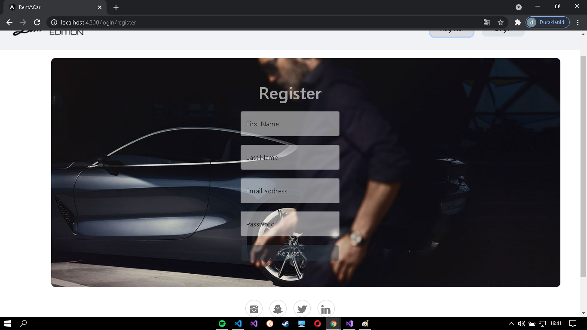
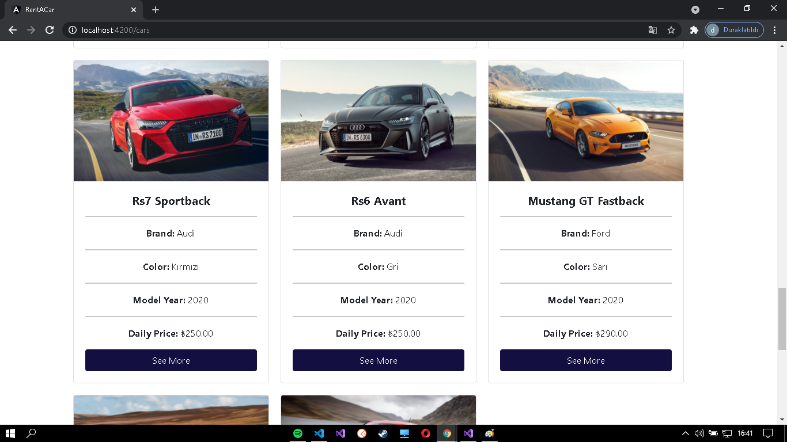
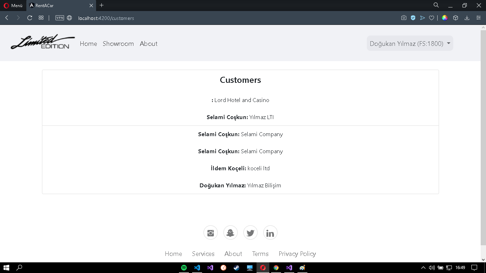
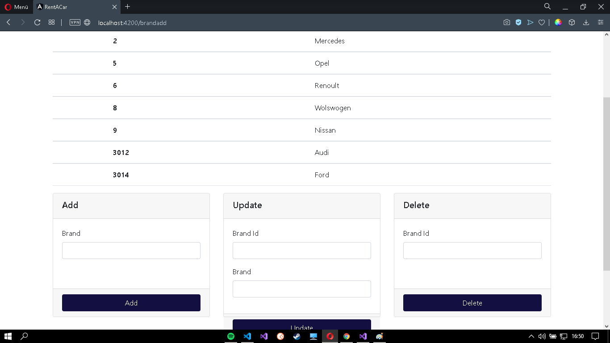

[](https://opensource.org/licenses/MIT)

<h1 align="center">Yazılım Geliştirici Yetiştirme Kampı (C# + ANGULAR)</h1>

<p align="center">
    
</p>

### Table of Contents
- [Description](#description)
- [How To Use](#how-to-use)
- [Screenshots](#screenshots)
- [License](https://github.com/Dogukanyllmaz/FinalProject/blob/master/LICENSE)
- [Author Info](#author-info)

---

## Description

- Go to Back-end codes --> [Rent-A-Car](https://github.com/Dogukanyllmaz/RentaCarProject)

#### Technologies

- [Angular](https://cli.angular.io)
- [Bootstrap](https://getbootstrap.com)
- [Node.js](https://nodejs.org/en/)
- [JQuery](https://jquery.com)

---

## How To Use

```bash
# Clone the repository
$ git clone https://github.com/Dogukanyllmaz/Rent-A-Car---FrontEnd

# Go to file
$ cd Rent-A-Car---FrontEnd.git

# Install dependencies
$ npm install
```

### Northwind

This project was generated with [Angular CLI](https://github.com/angular/angular-cli) version 11.2.3.

#### Development server

Run `ng serve` for a dev server. Navigate to `http://localhost:4200/`. The app will automatically reload if you change any of the source files.

#### Code scaffolding

Run `ng generate component component-name` to generate a new component. You can also use `ng generate directive|pipe|service|class|guard|interface|enum|module`.

#### Build

Run `ng build` to build the project. The build artifacts will be stored in the `dist/` directory. Use the `--prod` flag for a production build.

#### Running unit tests

Run `ng test` to execute the unit tests via [Karma](https://karma-runner.github.io).

#### Running end-to-end tests

Run `ng e2e` to execute the end-to-end tests via [Protractor](http://www.protractortest.org/).

#### Further help

To get more help on the Angular CLI use `ng help` or go check out the [Angular CLI Overview and Command Reference](https://angular.io/cli) page.
"# Kamp-FrontEnd" 
"# Kamp-Frontend" 
"# Final-Frontend" 
"# Kamp-Frontend" 


---

## Screenshots

<p align="center">
  
  
  
  
  
  
  
  
  
  
 
</p>

---

## License

MIT License

Copyright (c) 2021 Doğukan Yılmaz

---

## Author Info

- 💻 [Linkedin](https://www.linkedin.com/in/hüseyin-doğukan-yılmaz-75a1531ab/)

- 🎫 [Email](mailto:dogu_codem@hotmail.com?subject=[GitHub]%20Source%20Han%20Sans)
